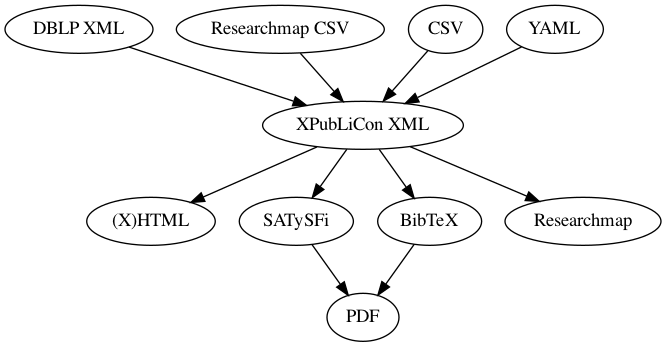

XPubLiCon
=========

[](./LICENSE)


An XML-based publication list converter.

Although most of the part is still unimplemented, XPubLiCon is trying to be a hub among various format for publication lists.



Usage
-----

### Validation

You can validate the input XML file using the schema (`schema.rnc`) in Relax NG compact syntax. For example, you can use [rnv](https://github.com/hartwork/rnv).

```bash
rnv schema.rnc ./example/data.xml
```

### (X)HTML Generation

You can generate a fragment of (X)HTML file from the input XML file using XSLT files. For example, you can use [xsltproc](http://xmlsoft.org/XSLT/xsltproc.html) or [saxon](http://saxon.sourceforge.net/). See also [./example/html/README.md](./example/html/README.md) for an example for generating a complete (X)HTML file.

```bash
xsltproc ./xslt/publications_html.xsl ./example/data.xml > publications.html
```
